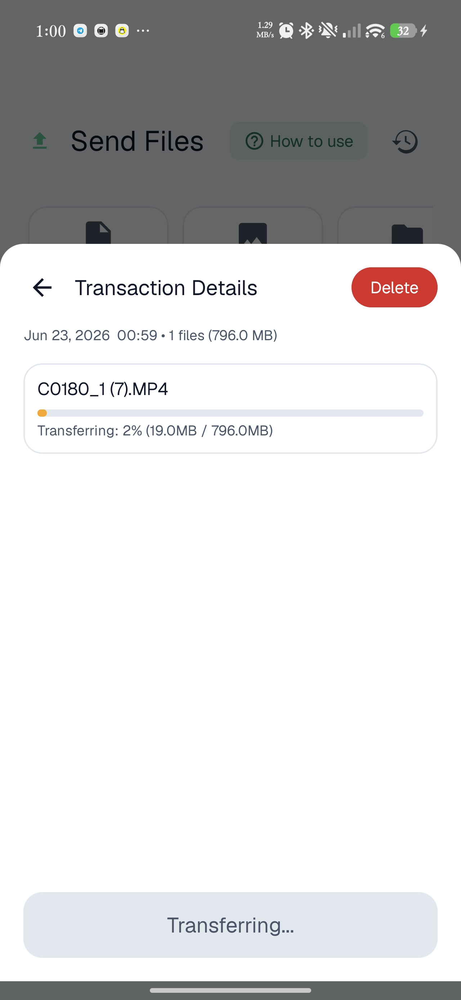
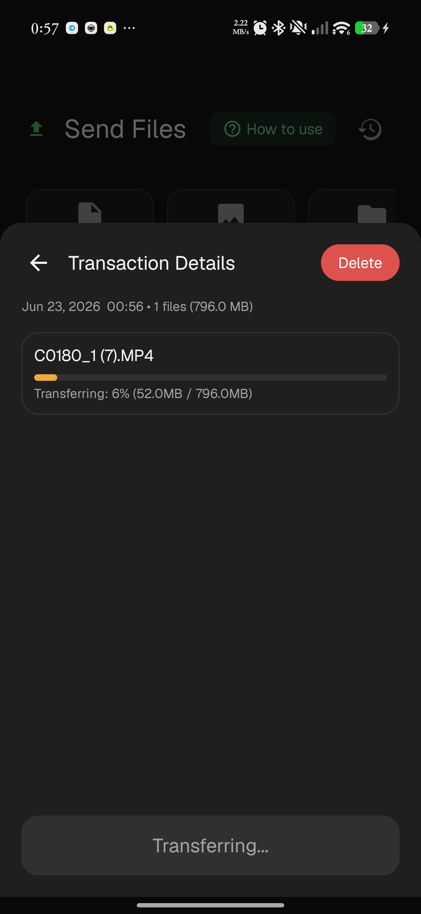
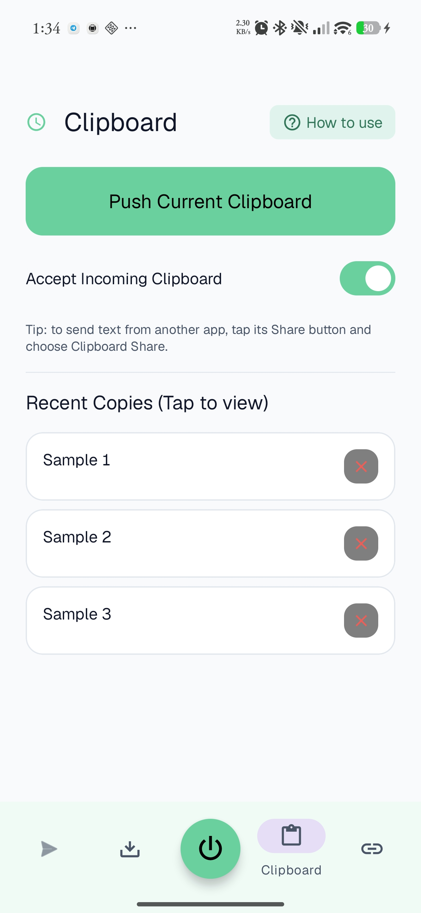
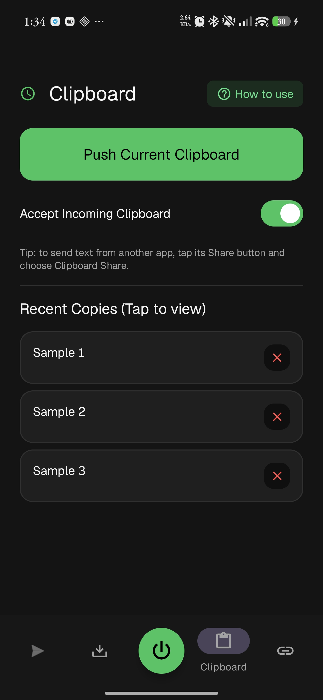
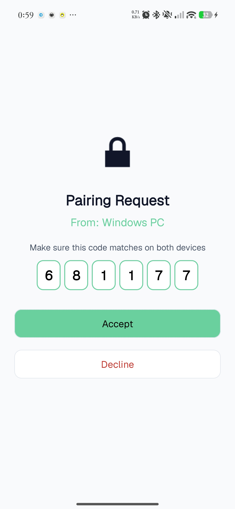
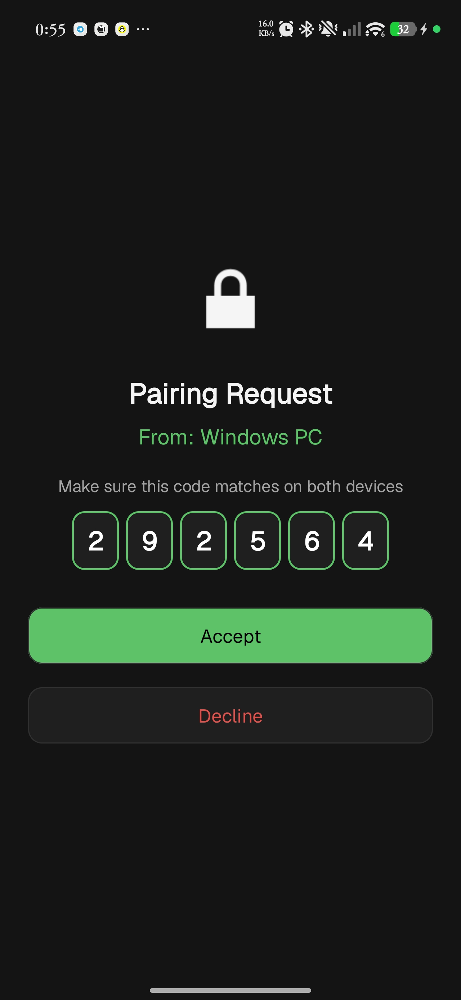
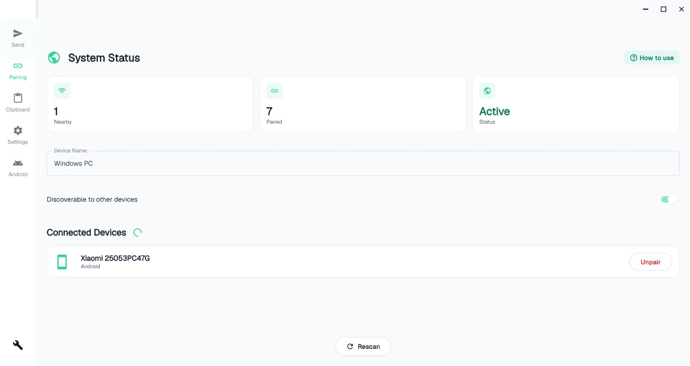
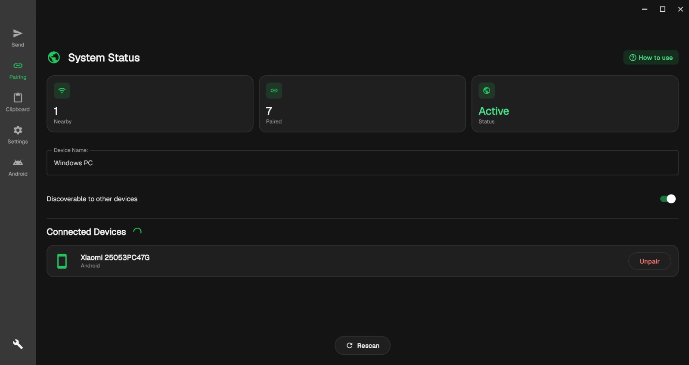
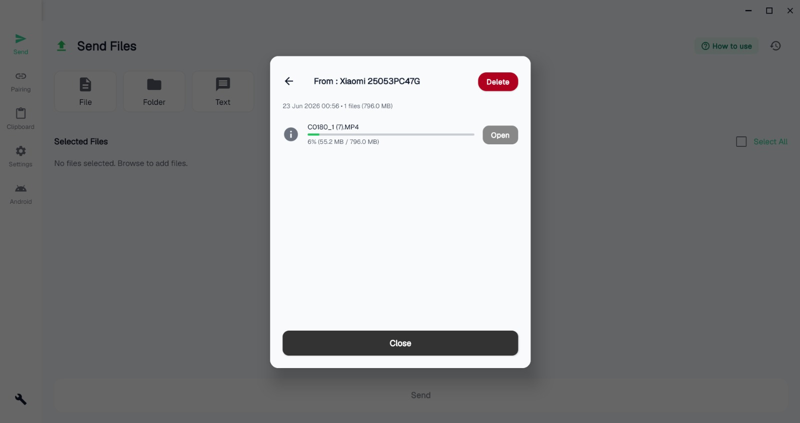
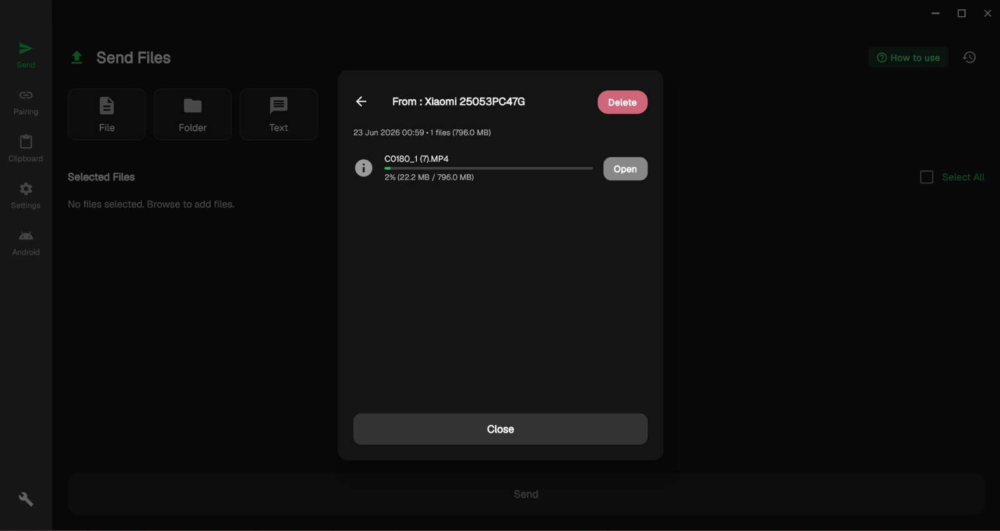

# 🌐 Clipboard Share

> **Status:** Android in beta on Google Play · Windows installer available below · **Version 3.5.2**

**Clipboard Share** is a privacy-first, cross-platform productivity tool with native **Android and
Windows** clients that speak one byte-identical wire protocol. It uses a custom peer-to-peer local
network to sync clipboards and transfer large files between devices — without ever routing your data
through third-party cloud servers.

  
  
  

---

## ⬇️ Download

- **Windows** — [**Download the installer**](https://github.com/josephting1105123/ClipboardShare-Showcase/releases/latest/download/ClipboardShareSetup.exe). The download starts immediately. Windows 10/11. The installer isn't code-signed yet, so SmartScreen may say "unknown publisher" — click **More info → Run anyway**.
- **Android** — [**Get it on Google Play**](https://play.google.com/store/apps/details?id=com.EntropicSoftwareLab.ClipboardShare). Android 10 or newer.

The Windows link always points at the newest release, so it never goes stale.

---

## 🚀 The Vision: Zero-Cloud, Zero-Trust

Most file-sharing apps share three flaws: they need internet access, they cap file sizes, and they
route personal clipboard data through company servers. Clipboard Share keeps 100% of traffic on your
local network using direct socket connections, and seals every payload with authenticated
encryption before it leaves the device. When there's no network at all, it builds its own link
between the two devices and transfers over that.

---

## 📱 Screenshots

**Android** — dynamic light & dark theming

| | Light | Dark |
| :--- | :---: | :---: |
| **File transfer** |  |  |
| **Clipboard sync** |  |  |
| **Secure pairing (SAS verify)** |  |  |

**Windows** — native desktop companion

| | Light | Dark |
| :--- | :---: | :---: |
| **Home** |  |  |
| **Transfer** |  |  |

---

## 🛠️ Architecture & Protocols

The source is private ahead of a wider release, but the engine is built on the following design.

### 1. Custom mesh discovery (UDP)
Devices broadcast their presence via UDP on port `50001` every 2 seconds. Each client tracks active
nodes in a `ConcurrentHashMap` and expires devices that drop off the network, so the device list
stays accurate without manual refresh.

### 2. Cryptographic handshake (ECDH + AES-256-GCM)
Connections require explicit user consent. On acceptance, the two devices agree a session key with
**Elliptic-Curve Diffie-Hellman (secp256r1)** and encrypt every payload with **AES-256-GCM**
(authenticated encryption — tamper-evident, not just confidential). Keys are held in Android's
`EncryptedSharedPreferences`, and **anti-downgrade trust pinning** fails the connection closed if a
paired peer ever tries to negotiate weaker terms than before.

### 3. Asynchronous payload delivery (TCP)
- **Clipboard sync (port `65432`)** — works around Android 10+ background-clipboard restrictions with
  a dual explicit-push and sync-on-focus model.
- **File transfer (port `65433`)** — a custom `BATCH|Manifest` protocol sends whole folders with no
  app-imposed size limit at raw LAN / Wi-Fi Direct speed, resumable across a dropped connection, and
  integrates with Android's **Storage Access Framework (SAF)** for custom save locations.

### 4. Off-grid transport ladder
With no router in reach, a **Bluetooth LE control channel** bootstraps the session and drives a
**transport ladder** — it tries each Wi-Fi-bearing tier in order (Wi-Fi Direct, `WifiNetworkSpecifier`,
LocalOnlyHotspot / SoftAP), and sender and receiver advance together so they never land on different
rungs. **QR-code and NFC pairing** exchange the keys to bring the private link up. Once it's up, the
bulk transfer is plain TCP over that link.

### 5. Cross-platform parity
The **Windows** client is a native Kotlin / Compose Desktop app that speaks the same byte-identical
wire protocol. Cross-platform crypto interop (FileSeal / ClipboardSeal golden vectors) is verified on
every commit in CI, so both clients seal and open bytes identically. The app ships in **10 languages**.

### 6. Modern Android compliance
The Android client targets the latest SDK (**API 36**) and supports **Android 10 (API 29)** and up,
using Foreground Services (`DATA_SYNC` type) and decoupled `BroadcastReceiver`s for stable background
execution.

---

## 🗺️ Roadmap

- [x] **V1.0** — Core UDP/TCP engine and cryptography
- [x] **V2.0** — Single-Activity refactor, SAF integration, dynamic theming
- [x] **V3.0 (Off-Grid)** — QR/NFC pairing + Wi-Fi Direct transport ladder, router-independent transfers
- [x] **Desktop client** — native Windows companion (Compose Desktop), one shared wire protocol
- [ ] Code-signed Windows installer (clear the SmartScreen warning)
- [ ] Google Play open testing → production

---

## 👨‍💻 About the Developer

Built by **Joseph Ting**, a pre-university student and self-taught software engineer working on
local-first networking, applied cryptography, and the edges of the Android hardware APIs.

*If you'd like to support development of the Windows client and keep the app ad-free, there's a
"buy me a coffee" link in the app.*
